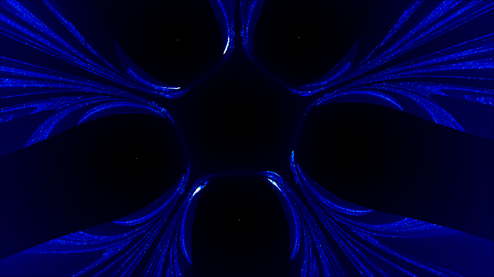
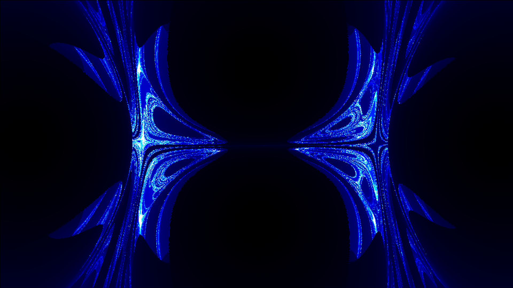
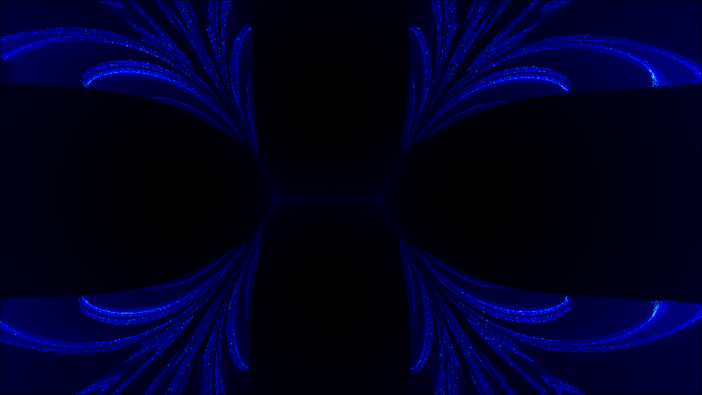
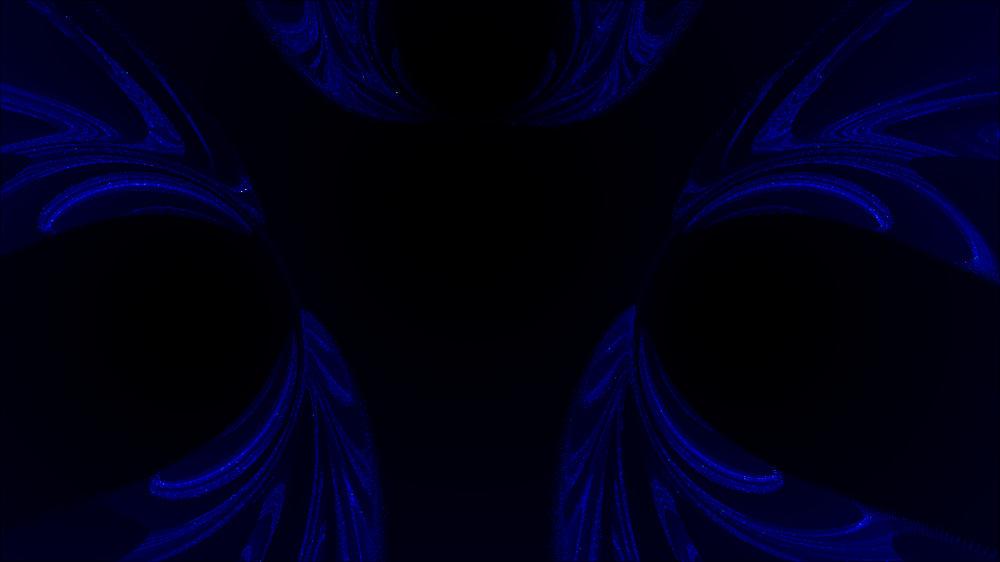
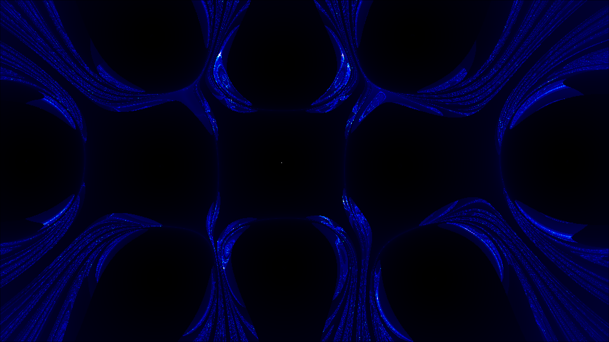

# GravityFlow
A simulation of gravity. The program renders a map which shows how stable orbits or locations are before an object will fly out of the system. 
You can use the left mouse button to drag gravity sources. Press the enter key to spawn new sources and the space key to render the map. You can also use the right mouse button to spawn a test object on the mouse location.

